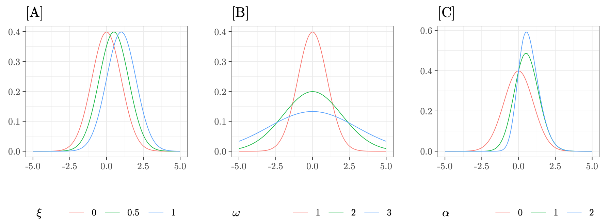

```{r}
library(knitr)
options(digits=3)
opts_chunk$set(fig.width=4, fig.height=3, fig.align='center',echo=FALSE,results="hide",comment=NA,prompt=FALSE,warning=FALSE,cache=TRUE)
```

```{r, include=FALSE}
rm(list=ls())
main <- "/Users/ambraperugini/Documents/Work/presentations/slides/Psychoco_2026/"

datadir <- paste0(main,"data/")
# KUtils::pulizia(paste(main,"knitr/",sep=""), c(".Rnw",".bib","pdf"),TRUE)
```

```{r, include=FALSE}
# ++++++++++++++++++++++++++++++++++
betapar <- function(mx,sx,n=NULL) {
  vx <- sx^2
  if (vx<(mx*(1-mx))) {
    pezzo <- ((mx*(1-mx))/vx)-1
    a <- mx*pezzo
    b <- (1-mx)*pezzo
  } else {
    warning("adjusted formula by using n")
    a <- mx*n
    b <- (1-mx)*n
  }
  return(list(a=a,b=b))
}

# +++++++++++++++++++++++++++
snpar <- function(xi=0,omega=1,alpha=0) {
  delta <- alpha/sqrt(1+alpha^2)
  mu <- xi + omega * delta * sqrt( 2/pi )
  sigma2 <- omega^2 * ( 1 - (2*delta^2)/pi )
  return(list(mu = mu, sigma = sqrt(sigma2)))
}

# +++++++++++++++++++++++++++
sninvpar <- function( mu=0, sigma=1, xi=NULL, omega=NULL, alpha=0 ) {
  
  if (is.null(omega)) {
    delta <- alpha/sqrt(1+alpha^2)
    omega2 <- sigma^2 / ( 1 - (2*delta^2) / pi )
    omega <- sqrt( omega2 )
  }
  
  if (is.null(xi)) {
    delta <- alpha/sqrt(1+alpha^2)
    xi <- mu - omega * delta * sqrt( 2/pi )
  }
  
  return( list( xi = xi, omega = omega, alpha = alpha ) )
  
}

# +++++++++ funzione colori default
gg_color_hue <- function(n) {
  hues = seq(15, 375, length = n + 1)
  hcl(h = hues, l = 65, c = 100)[1:n]
}

# +++++++++++++++++++++++++++++++
#' @name min_normal_uniform
#' @description Calcola il minimo tra la densità di una normale e di una uniforme
#' @param x = x vector
#' @param normPars = parametri della normale: media e dev. standard
#' @param unifPars = parametri della uniforme: minimo e massimo
#' #' @param return.all = logical, if \code{TRUE} restituisce il data set completo delle densità delle due distribuzioni
min_normal_uniform <- function( x = NULL, normPars = c(0,1), unifPars = c(0,1), return.all = FALSE ) {
  
  if (is.null(x)) x <- seq(-5,5,by=.1)
  
  y1 <- dnorm(x, normPars[1], normPars[2])
  y2 <- dunif(x, unifPars[1], unifPars[2])
  dy <- ifelse(y1<y2, y1, y2)
  
  gData <- data.frame( x, y1, y2, dy )  
  
  if (return.all) {
    return( list( gData = gData ) )
  } else {
    return( dy )  
  }

}


# +++++++++++++++++++++++++++++++++++
#' @name min_dskew_normal
#' @description Calcola il minimo tra due densità Skew-Normal
#' @param x = x vector
#' @param xi = vector of location parameters
#' @param omega = vector of scale parameters
#' @param alpha = vector of skewness parameters
#' @param plot = logical, if \code{TRUE} produce la rappresentazione grafica delle densità 
#' e dell'area di sovrapposizione
#' @param return.all = logical, if \code{TRUE} restituisce il data set completo delle 
#' densità delle due distribuzioni
min_dskew_normal <- function( x = seq( -5, 5, by = .01 ), xi = c(0,0), omega = c(1,1), alpha = c(0,0), 
                              return.all = FALSE ) {
  
  if (length(xi)==1) xi <- rep(xi,2)
  if (length(omega)==1) omega <- rep(omega,2)
  if (length(alpha)==1) alpha <- rep(alpha,2)
  
  require( sn )
  y1 <- dsn( x, xi = xi[1], omega = omega[1], alpha = alpha[1] )
  y2 <- dsn( x, alpha = alpha[2], xi = xi[2], omega = omega[2] )
  dy <- ifelse( y1 < y2, y1, y2 )
  gData <- data.frame( x, y1, y2, dy )  
  
  if (return.all) {
    return( list( gData = gData ) )
  } else {
    return( dy )  
  }
}

# ++++++++++++++++++++++++++++
#' @name permTest
#' @description Esegue test di permutazione su overlapping, 
#'differenza tra medie e rapporto tra varianze
#' @param xList = lista di due elementi (\code{x1} e \code{x2} ) 
#' @param B = numero di permutazioni da effettuare
#' @param ov.type = character, type of index. If type = "2" returns the proportion of the overlapped area between two or more densities. 
#' @note Il confronto tra le medie è ad una sola coda e 
#'testa l'ipotesi che le medie siano uguali vs l'ipotesi
#'che la seconda sia maggiore della prima (\code{mean(x2) > mean(x1)})
#' @return Restituisce una lista con tre elementi:
#' obs = vettore dei valori osservati di non-sovrapposizione 
#'       \coed{1-eta}, differenza tra le medie (\code{mean(x2)-mean(x1)}), 
#'       rapporto tra le varianze
#' perm = matrice Bx3 con i valori delle stesse statistiche ottenute
#'        via permutazione
#' pval = vettore con i tre p-values   
permTest <- function( xList, B = 1000, ov.type = c("1","2")) {
  
  require(overlapping)
  ov.type <- match.arg(ov.type)
  names(xList) <- c("x1","x2")
  N <- unlist( lapply(xList,length) )
  
  # observed statistics
  zobs <- 1-overlap( xList, type = ov.type )$OV
  dobs <- diff( unlist( lapply(xList, mean) ) )
  Fobs <-  with( xList, var.test(x1,x2)$statistic )
  OBS <- data.frame(zobs,dobs,Fobs)
  Mobs <- matrix( OBS, nrow=B, ncol=3, byrow = TRUE )
  
  Yperm <- t( sapply(1:B, function(b){
    xperm <- sample( unlist( xList ) )
    xListperm <- list( x1 = xperm[1:N[1]], x2 = xperm[(N[1]+1):(sum(N))] )
    
    zperm <- 1 - overlap( xListperm, type = ov.type )$OV
    dperm <- diff( unlist( lapply(xListperm, mean) ) )
    Fperm <-  with( xListperm, var.test(x1,x2)$statistic )
    
    out <- c(zperm,dperm,Fperm)
    names(out) <- c("zperm","dperm","Fperm")
    out
  }) )
  
  PVAL <- (apply( Yperm >= Mobs, 2, sum )+1)/(nrow(Yperm)+1)
  L <- list(obs=OBS,perm=Yperm,pval=PVAL)
  
  return(L)
}

# ++++++++++++++++++++++++++
#' @name numeriAPA
#' @description Toglie lo zero dagli indici inclusi nell'intervallo [0,1], secondo norme APA
numeriAPA <- function(x) {
  gsub("0\\.","\\.",as.character(x))
}

## +++++++++++++++++++++++++++++++++++++++++++
#' @title Grafico correlazioni
#' @param RR = correlation matrix
#' @param U = vettore con i margini del grafico
plot_correlation <- function(RR,values=FALSE,textsize=12,legendsize=10,angle=0, corrsize=4, U=c(0,0,0,0), short.names = FALSE) {
  require(ggplot2)
  require(reshape2)
  RR <- melt(RR)
  NAME <- "Correlation"
  
  if (short.names) {
    levels(RR$Var2) <- paste0("(",1:length(levels(RR$Var2)),")")
  }
  
  GGcor <- ggplot(RR,aes(Var2,Var1,fill=value))+geom_tile()+
    scale_fill_gradient2(low = "blue", high = "red", mid = "white",midpoint =0, space = "Lab",name=NAME)+
    xlab("")+ylab("")+coord_fixed()+
    theme(plot.margin = unit(U, "cm"),
          text=element_text(size=textsize),
          axis.text.x=element_text(angle=angle),
          legend.text = element_text(size = legendsize),legend.title = element_text(size = legendsize)) 
  
  if (values) {
    GGcor <- GGcor + geom_text(aes(Var2, Var1, label = round(value,2)), color = "black", size = corrsize )
  }
  print(GGcor)
}

# ++++++++++++++++++++++++++++
#' @name perm.test
#' @description Esegue test di permutazione su overlapping, 
#'differenza tra medie e rapporto tra varianze
#' @param x = lista di due elementi (\code{x1} e \code{x2} ) 
#' @param B = numero di permutazioni da effettuare
#' @return Restituisce una lista con tre elementi:
#' obs = valore osservato di non-sovrapposizione 
#'       \coed{1-eta}
#' perm = valori della stessa statistica ottenute
#'        via permutazione
#' pval = p-value   
perm.test <- function (x, B = 1000, 
               return.distribution = FALSE, ...)
{
  
  # control 
  args <- c(as.list(environment()), list(...))
  pairsOverlap <- ifelse(length(x)==2, FALSE, TRUE)
  
  N <- unlist( lapply(x,length) )
  out <- overlap(x, ...)
  
  if (pairsOverlap) {
    zobs <- 1-out$OVPairs
    Zperm <- t(sapply(1:B, function(b) {
      xListperm <- perm.pairs( x )
      ovperm <- unlist( lapply(xListperm, overlap, ...) )
      zperm <- 1 - ovperm
    }))
  } else {
    zobs <- 1-out$OV
    Zperm <- t(sapply(1:B, function(b) {
      xperm <- sample( unlist( x ) )
      xListperm <- list( x1 = xperm[1:N[1]], x2 = xperm[(N[1]+1):(sum(N))] )      
      zperm <- 1 - overlap( xListperm, ... )$OV
    }))
  }
  
  
  ## (sum( zperm >= obsz ) +1) / (length( zperm )+1) LIVIO
  
  colnames(Zperm) <- gsub("\\.OV","",colnames(Zperm))
  if (nrow(Zperm) > 1) {
    
    ZOBS <- matrix( zobs, nrow(Zperm), ncol(Zperm), byrow = TRUE )
    pval <- (apply( Zperm > ZOBS, 2, sum ) + 1)/ (nrow(Zperm)+1)
    
  } else {
    pval <- (sum(Zperm > zobs)+1) / (length(Zperm)+1)
  }
  
  if (return.distribution) {
    return(list(Zobs = zobs, pval = pval, Zperm = Zperm))
  } else {
    return(list(Zobs = zobs, pval = pval))  
  }
  
  
}

```


## The Overlapping Index

The overlapping ($\eta$) is an index of effect size and varies from 0 and 1, formally defined in the following way:

```{=tex}
\begin{eqnarray}
\eta (A,B) = \int_{\mathbb{R}^n} min [f_A (x),f_B (x)] dx
\end{eqnarray}
```
$\eta (A,B)$ is normalized to one and when the distributions of A and B do not have points in common, meaning that $f_A (x)$ and $f_B (x)$ are disjoint, $\eta (A,B) = 0$

## Hypothesis testing

\

- Usually $H_0$ is defined as the absence of an effect.

- $\eta = 1$ means complete overlap

- We define the complement $\zeta$ as $1 - \eta$ and define $H_0 : \zeta = 0$ meaning that there is no difference between the densities of the two populations.

## Permutation test

::: {style="font-size: 80%;"}

-   Rearranges the data $B$ times
-   Calculates the statistic for each new dataset of permuted data
-   Calculates $p$-value as the probability of obtaining equal or more extreme values

<!-- The basic principle of permutation testing is based on the idea of rearranging observed data to generate a null distribution and for each new dataset of rearranged data the statistic is recalculated. The $p$-value is the probability of obtaining an equal or more extreme $t$-statistic compared to the observed one. -->

```{=tex}
\begin{eqnarray}
p=\frac{(\sum_{b=1}^B |t_b|\geq |t|)+1}{B+1}
\end{eqnarray}
```


where $B$ is the number of random permutations, $t$ is the $t$-statistic computed on the observed data, $t_b$ are those computed on the permuted data.
:::


## Applied to the Overlapping

\

The permutation test is applied to $\zeta$:


```{=tex}
\begin{eqnarray*}
p = \frac{(\# \hat{\zeta}_b \geq \hat{\zeta})+1 }{B+1}
\end{eqnarray*}
```

The principle is the same, we shuffle the data and calculate $\zeta$ B times to calculate the $p$-value.

## Example on Reaction Time

```{r example_rt,include=FALSE, cache=TRUE}

DATA<-read.csv(paste0(datadir,"EngTurk.csv"))

# works with high and low frequency in English
table(DATA$item[DATA$ItemType == "High_freq" & DATA$Language == "English"])
table(DATA$item[DATA$ItemType == "Low_freq" & DATA$Language == "English"])
# blue eyes 
# foreign business

low_frequency <-DATA$ReactionTime[DATA$item == "poor children"]
high_frequency <- DATA$ReactionTime[DATA$item == "blue eyes"]

library(datawizard)
library(overlapping)
xList <- list( x1 = low_frequency, x2 = high_frequency ) 
length(unlist(xList))
obsz <- 1 - overlap( xList )$OV
MX <- lapply(xList, mean, na.rm=T)
SDX <- lapply(xList, var, na.rm=T)
SKX <- lapply(xList, skewness, na.rm=T)

B <- 2e3
n <- length(xList[[1]])
zperm <- sapply( 1:B, function(x){
  xperm <- sample( unlist( xList ) )
  xListperm <- list( x1 = xperm[1:n], x2 = xperm[(n+1):(n*2 )] )
  1 - overlap( xListperm )$OV
})

PVAL <- (sum( zperm > obsz )+1) / (length( zperm )+1)

```

```{r}

x1List <- list( x1 = low_frequency, x2 = high_frequency ) 
x1List[[1]] <- c(x1List[[1]], NA)
Y <- stack(data.frame(x1List))
ZPERM <- data.frame(zperm)

theme_set(theme_bw())
cowplot::plot_grid(
  ggplot( Y, aes(values,fill=ind,color=ind) )+geom_density(alpha = .5) + theme(legend.title = element_blank()) +xlab("") +ylab("")+guides(fill="none",color="none")+ggtitle("[A]"),

  ggplot(ZPERM,aes(zperm))+geom_vline(xintercept = obsz,lty=2) +geom_density()+ggtitle("[B]")  +xlab("") +ylab(""), 
  ncol=2

)

```

::: {style="font-size: 70%;"}

Panel [A] shows the two conditions with $\eta = .67$ and $\zeta = .33$, panel [B] shows the distribution of the $\zeta$ statistic obtained through permutation ($p = .011$)

:::

## The simulation study

We simulated from the Skew-Normal distribution.

{.absolute bottom="40" width="1200" height="430"}

## The simulation study


```{r scenari,fig.width=7,message=FALSE}
library(sn)

PARlist <- list(
  xi_vec = c(0,0.2,0.5,1),
  omega_vec = c(1,2,3),
  alpha_vec = c(0,1,2),
  n_vec = c(10, 20, 50, 100, 500)
)

x <- seq(-5,5,by=.1)

gData <- NULL
for (j in 1:3) {
  
  # xi
  y <- with( PARlist, dsn(x,xi_vec[j],omega_vec[1],alpha_vec[1]) )
  xi <- PARlist$xi_vec[j]
  omega <- PARlist$omega_vec[1]
  alpha <- PARlist$alpha_vec[1]
  scenario <- "xi"
  dd <- data.frame(x,y,xi,omega,alpha,scenario)  
  gData <- rbind(gData,dd)  
  
  # omega
  y <- with( PARlist, dsn(x,xi_vec[1],omega_vec[j],alpha_vec[1]) )
  xi <- PARlist$xi_vec[1]
  omega <- PARlist$omega_vec[j]
  alpha <- PARlist$alpha_vec[1]
  scenario <- "omega"
  dd <- data.frame(x,y,xi,omega,alpha,scenario)  
  gData <- rbind(gData,dd)  
   
  # alpha
  y <- with( PARlist, dsn(x,xi_vec[1],omega_vec[1],alpha_vec[j]) )
  xi <- PARlist$xi_vec[1]
  omega <- PARlist$omega_vec[1]
  alpha <- PARlist$alpha_vec[j]
  scenario <- "alpha"
  dd <- data.frame(x,y,xi,omega,alpha,scenario)  
  gData <- rbind(gData,dd)  
  
}

gData$xi <- factor(gData$xi)
gData$omega <- factor(gData$omega)
gData$alpha <- factor(gData$alpha)


```

```{r}
load(paste0(datadir,"R02_sim07.rda"))
NTAB <- table(ALL$n,ALL$mu,ALL$sigma,ALL$alpha)

```

::: {style="font-size: 95%;"}
-   $\delta$ = (`r PARlist$xi_vec`); mean of the second population; <!-- , which corresponds also to the difference between the two groups, the first one has always $\mu = 0$ -->
-   $\sigma$ = (`r PARlist$omega_vec`); standard deviation of the second population;
-   $\alpha$ = (`r PARlist$alpha_vec`); degree of asymmetry (skewness) of the second population;
-   $n$ = (`r PARlist$n_vec`); sample size, equal in the two samples.
:::

For each of the `r length(PARlist$xi_vec)` $\times$ `r length(PARlist$omega_vec)` $\times$ `r length(PARlist$alpha_vec)` $\times$ `r length(PARlist$n_vec)` $= 180$ conditions we generated `r NTAB[1,1,1,1]` sets of data on which we performed the analysis.


## Statistical tests for comparison

::: {style="font-size: 80%;"}
For each combination $\delta$ $\times$ $\sigma$ $\times$ $\alpha$ $\times$ $n$, on the generated data were performed the following tests:

-   **Permutation test** on the complement of the **Overlapping Index** ($\zeta_{ov}$), $\zeta = 1-\eta$; <!-- , which therefore becomes an index of difference between groups -->
-   **$F$ test** (F) of homogeneity of variances;
-   **Kolmogorov-Smirnov test** (ks) comparing the cumulative distributions.
-   **Wilcoxon-Mann-Whitney test** (wmw) on ranks;
-   **Welch test** (w) assuming normality but not homogeneity of variance;
-   **$t$ test** (t) for independent samples, assuming equal variance and normality;
:::

```{r}
load(paste0(datadir,"sim07.rda"))

ALL$mu <- factor(with(ALL, snpar(delta,omega,alpha)$mu))
ALL$sigma <- factor(with(ALL, snpar(delta,omega,alpha)$sigma))

INDICI <- colnames(ALL)[grep("pval",colnames(ALL))]
INDICI <- INDICI[!(grepl("_norm",INDICI)|grepl("F_",INDICI)|grepl("mean_",INDICI))]

LEGENDA <- data.frame( var = colnames(ALL), desc = c("media camp. 1", "sd camp. 1","media camp. 2", "sd camp. 2", "overlapping tipo 1", "overlapping tipo 2", "sample size","differenza tra le xi","skewness","varianza","vera sovrapposizione","t test","welch test","wilcoxon test", "var test", "overlapping perm","mean perm", "var perm", "shapiro camp. 1", "shapiro camp. 2","kolmogorov","media secondo campione","ds secondo campione") )

ALL <- subset(ALL, (mu %in% PARlist$mu_vec) & (alpha %in% PARlist$alpha_vec ) & (sigma %in% PARlist$sigma_vec))
ALL$mu <- factor(ALL$mu)
ALL$sigma <- factor(ALL$sigma)

MUSI <- with( PARlist, expand.grid(mu=mu_vec, sigma=sigma_vec, alpha = alpha_vec) )

DESIGN <- NULL 
for (i in 1:nrow(MUSI)) {
  DESIGN <- rbind( DESIGN, unlist( with( MUSI, sninvpar(mu[i],sigma[i],alpha = alpha[i]) )) )
}

DESIGN <- data.frame(DESIGN)
DD <- with( DESIGN, expand.grid( xi = unique(xi), omega = unique(omega), 
              alpha = unique(alpha), n = PARlist$n_vec ) )
DESIGN <- apply(DD, 1, as.list)

DD <- do.call(rbind,lapply(DESIGN, function(x){
  unlist(x)
}))
DD <- data.frame( unique( DD[,c("xi","omega","alpha")] ) )
DD$mu <- factor(with(DD, snpar(xi,omega,alpha)$mu))
DD$sigma <- factor(with(DD, snpar(xi,omega,alpha)$sigma))

DD <- subset( DD, (mu %in% PARlist$mu_vec)  & (alpha %in% PARlist$alpha_vec ) & (sigma %in% PARlist$sigma_vec))


library(sn)
library(brms)

x <- seq(-5,5, by=.01)
gData <- data.frame(x=x)
gData$z <- dskew_normal(x,xi=0,omega=1)

for (i in 1:nrow(DD)) {
  k <- with(DD, paste0("mu_",mu[i],"_sigma_",sigma[i],"_alpha_",alpha[i]))
  y <- dsn( gData$x, xi = DD$xi[i], omega = DD$omega[i], alpha = DD$alpha[i] )
  
  gData <- cbind(gData,y)
  colnames(gData)[ncol(gData)] <- k
  
}


ALL$zeta_perm_sig <- ifelse(ALL$zeta_perm_pval<=.05,TRUE,FALSE)
ALL$t_pval_sig <- ifelse(ALL$t_pval <= .05, TRUE, FALSE)
ALL$welch_pval_sig <- ifelse(ALL$welch_pval <= .05, TRUE, FALSE)
ALL$wilcox_pval_sig <- ifelse(ALL$wilcox_pval <= .05, TRUE, FALSE)
ALL$vartest_pval_sig <- ifelse(ALL$vartest_pval <= .05, TRUE, FALSE)
ALL$ks_test_pval_sig <- ifelse(ALL$ks_test_pval <= .05, TRUE, FALSE)

ALL$zeta_perm_H0_true <- with(ALL, ifelse(mu==0 & sigma == 1 & alpha == 0, TRUE, FALSE))
ALL$t_H0_true <- with(ALL, ifelse(mu==0, TRUE, FALSE))
ALL$welch_H0_true <- with(ALL, ifelse(mu==0, TRUE, FALSE))
ALL$wilcox_H0_true <- with(ALL, ifelse(mu==0 & sigma == 1 & alpha == 0, TRUE, FALSE))
ALL$vartest_H0_true <- with(ALL, ifelse(sigma == 1, TRUE, FALSE))
ALL$ks_H0_true <- with(ALL, ifelse(mu==0 & sigma == 1 & alpha == 0, TRUE, FALSE))

PW <- aggregate( zeta_perm_sig ~ n+zeta_perm_H0_true, data = ALL, FUN = mean)
PW$t_sig <- aggregate( t_pval_sig ~ n+t_H0_true, data = ALL, FUN = mean)$t_pval_sig
PW$welch_sig <- aggregate( welch_pval_sig ~ n+welch_H0_true, data = ALL, FUN = mean)$welch_pval_sig
PW$wilcox_sig <- aggregate( wilcox_pval_sig ~ n+wilcox_H0_true, data = ALL, FUN = mean)$wilcox_pval_sig
PW$vartest_sig <- aggregate( vartest_pval_sig ~ n+vartest_H0_true, data = ALL, FUN = mean)$vartest_pval_sig
PW$ks_sig <- aggregate( ks_test_pval_sig ~ n+ks_H0_true, data = ALL, FUN = mean)$ks_test_pval_sig

Y <- stack(PW[,grep("_sig",colnames(PW))])
Y$H0 <- PW$zeta_perm_H0_true
Y$n <- PW$n

```


## 


```{r}
library(ggplot2)

theme_set(theme_bw())

```

```{r}
#| fig-width: 8


ggplot(subset(Y, H0 == TRUE),
       aes(n, values, color = ind, shape = ind)) +
  geom_hline(yintercept = .05, lty = 3) +
  geom_line() +
  geom_point() +
  ggtitle(expression(paste("Type I error: ",H[0], " true"))) +
  ylab(expression(paste("P(reject ", H[0], ")"))) +
  xlab("sample size (per group)") +
  scale_color_discrete(
    labels = c(
      expression(paste(zeta[o][v])),
      expression("t"),
      expression("w"),
      expression("wmw"),
      expression("F"),
      expression("ks")
    )
  ) +
  guides(shape = "none") +
  theme(
    legend.title = element_blank(),
    legend.text  = element_text(size = 24, face = "italic"),

    plot.title   = element_text(size = 30, face = "bold"),
    axis.title.x = element_text(size = 26),
    axis.title.y = element_text(size = 26),
    axis.text    = element_text(size = 15)
  )

```

## 

```{r}
#| fig-width: 8

  ggplot( subset(Y,H0==FALSE), aes(n,values,color=ind,shape=ind))  + geom_hline(yintercept = .05, lty = 3) + geom_line() + geom_point() + ggtitle(expression(paste("Power: ",H[0], " false"))) + ylab(expression(paste("P(reject ", H[0],")"))) + xlab("sample size (per group)")  +
  scale_color_discrete(
    labels = c(
      expression(paste(zeta[o][v])),
      expression("t"),
      expression("w"),
      expression("wmw"),
      expression("F"),
      expression("ks")
    )
  ) +
  guides(shape = "none") +
  theme(
    legend.title = element_blank(),
    legend.text  = element_text(size = 24, face = "italic"),

    plot.title   = element_text(size = 30, face = "bold"),
    axis.title.x = element_text(size = 26),
    axis.title.y = element_text(size = 26),
    axis.text    = element_text(size = 15)
  )

```


## Discussion

- The $\zeta$ overlapping test outperforms in terms of power other tests, except for the F test, which does not control well for type I error. 

- As a non-parametric test, it allows to make inference on the entire distribution without making any assumptions.

- It is an intuitive index and it allows to investigate group differences beyond the mean.


## To find out more:

Here you can find our pre-print, on the implementation of the permutation test for the overlapping index:

::: {style="text-align: center;"}

[https://osf.io/preprints/osf/8h4fe_v1](https://osf.io/preprints/osf/8h4fe_v1){preview-link="true" style="text-align: center"}
:::

{.absolute bottom="20" right="100" width="300" height="300"}


